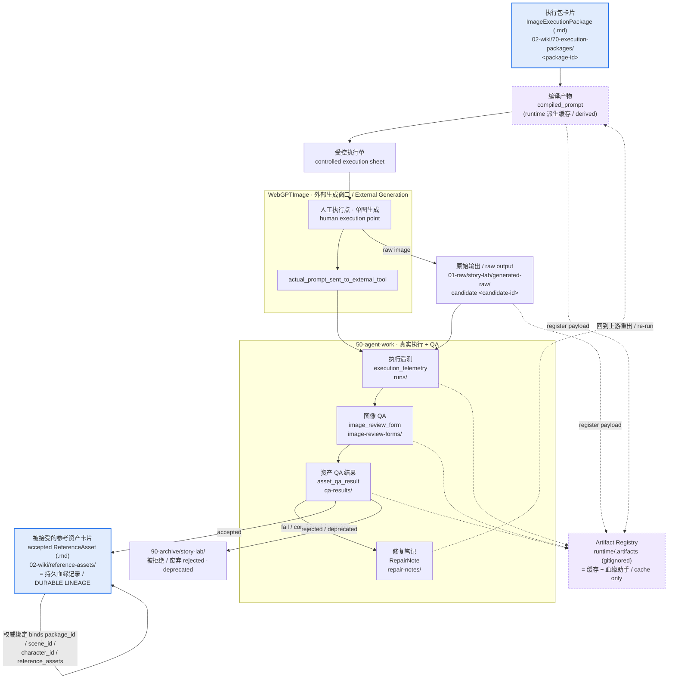

# 图像生产血缘图 / Image Production Lineage Map

> ARCHITECTURE / LINEAGE MAP ONLY. 本文件只描述一张图像资产的血缘结构与流转，不实例化任何真实图像、提示、角色或资产。所有引用一律使用占位符（例如 `<asset-id>`、`<candidate-id>`、`<package-id>`、`EXAMPLE_VALUE`、占位）。
> This is a lineage map. It never instantiates a real image, prompt, character, or asset. Every reference is a placeholder.

## 1. 这张图回答什么 / What This Map Answers

本图从**单张图像资产的血缘（lineage）**角度回答：一张图从 **执行包（execution package）** 到 **外部生成（WebGPTImage）**，到 **`01-raw` 原始输出**，到 **`50-agent-work` 的遥测 + 图像 QA + 资产 QA**，最终成为 **`02-wiki` 中被接受的参考资产卡片（accepted ReferenceAsset card）** 或被拒绝转入 **`90-archive`** 的完整链条；并强调：**持久血缘记录是 Markdown 卡片，Artifact Registry 只是缓存。**

This map traces one image asset's lineage from execution package → external generation (WebGPTImage) → raw output in `01-raw` → telemetry + image QA + asset QA in `50-agent-work` → an accepted ReferenceAsset card in `02-wiki` (or rejected → `90-archive`). The durable lineage record is the Markdown card; the Artifact Registry is a cache.

相关角度 / Related views: [story-production-system-map.md](./story-production-system-map.md) · [runtime-tool-boundary-map.md](./runtime-tool-boundary-map.md) · [webgpt-two-window-workflow-map.md](./webgpt-two-window-workflow-map.md)

## 2. 血缘链流程图 / Lineage Flow Diagram



## 3. 血缘如何被追溯 / How Lineage Is Traced

一张被接受的参考资产，其血缘必须可以沿下面这条链 **逐跳回溯（trace back hop-by-hop）**：

```
compiled_prompt
  → external_generation_candidate (candidate <candidate-id> in 01-raw)
    → execution_telemetry (actual_prompt_sent_to_external_tool)
      → image QA (image_review_form, 人工证据 / human evidence)
        → asset_qa_result
          → accepted_reference_asset (ReferenceAsset card in 02-wiki)
```

逐环说明 / Hop-by-hop:

1. **执行包 → `compiled_prompt`。** 执行包卡片（`02-wiki/70-execution-packages/<package-id>`）经 runtime 编译，得到 `compiled_prompt`。`compiled_prompt` 是 **派生缓存**，不是规范卡片。

2. **`compiled_prompt` → 受控执行单 → 候选图。** 编译产物被裁剪为受控执行单交给 WebGPTImage 窗口；在人工执行点生成单张候选图（`candidate <candidate-id>`），原始图像首次落入 `01-raw/story-lab/generated-raw/`。

3. **候选图 → `execution_telemetry`。** 外部执行后回填遥测：记录 `actual_prompt_sent_to_external_tool`、工具/模型/尺寸/种子/重试、输出路径与人工操作备注，并对比编译 prompt 标记任何删改。遥测落 `50-agent-work/story-lab/runs/`。**没有 `actual_prompt_sent_to_external_tool` 不得进入资产验收。**

4. **遥测 → 图像 QA。** 生成 `image_review_form`，要求人工回答与证据（不做自动图像识别），校验后并入 `asset_qa_result`。

5. **图像 QA → `asset_qa_result`。** 资产级细粒度验收汇总遥测 + 图像 QA + 资产 QA 三者，输出 `accepted` / `rejected` / `conditional` / `pending`。

6. **`asset_qa_result` → 接受或归档。**
   - **接受**：写回 `02-wiki/reference-assets/` 的参考资产卡片，并 **绑定 `package_id` / `scene_id` / `character_id` / `reference_assets`**。这张 Markdown 卡片就是 **持久血缘记录**。
   - **拒绝/废弃**：移入 `90-archive/story-lab/`；被拒绝或废弃的资产 **不得再作为参考依赖（reference dependency）** 使用。
   - **任何失败都进入修复队列**：在 `repair-notes/` 开 RepairNote，并回到上游（视觉本体 / Prompt 编译）重出，**不直接改候选图**。

## 4. 规范记录 vs 缓存 / Canonical Record vs Cache

| 血缘环节 / Lineage Hop | 落点 / Where | 性质 / Nature |
| --- | --- | --- |
| `compiled_prompt` | runtime（`.runs` / `.artifacts`） | 派生缓存 / derived cache (gitignored) |
| candidate（原始图） | `01-raw/story-lab/generated-raw/` | 原始事实，只追加 / append-only |
| `execution_telemetry` | `50-agent-work/.../runs/` | 中间物 / intermediate |
| `image_review_form` | `50-agent-work/.../image-review-forms/` | 中间物 / intermediate |
| `asset_qa_result` | `50-agent-work/.../qa-results/` | 中间物 / intermediate |
| **accepted ReferenceAsset card** | **`02-wiki/reference-assets/`** | **规范 + 持久血缘 / canonical** |
| Artifact Registry 条目 | `runtime/.artifacts/`（gitignored） | 缓存 + 血缘助手 / cache + lineage helper |

## 5. 核心规则 / Core Rules

1. **持久血缘记录是 `02-wiki` 中的 Markdown 参考资产卡片。** Artifact Registry 是 **缓存 + 血缘助手（lineage helper）**，**不是规范资产登记表**；规范登记表是 `02-wiki` 的参考资产卡片 + 执行包卡片集合。
2. **图像文件是资产，Markdown 是可维护的知识层。** 二进制图像不进 git；卡片记录其位置、来源与血缘。
3. **接受需三件套：遥测 + 图像 QA + 资产 QA。** 缺一不得 `accepted`。
4. **被接受的资产必须绑定 `package_id` / `scene_id` / `character_id` / `reference_assets`** 并写回参考资产卡片。
5. **被拒绝 / 废弃的资产进入 `90-archive`，且不得作为参考依赖。**
6. **每次失败进入修复队列**（`repair-notes/` 开 RepairNote），回到上游重出，不直接改候选图。
7. **外部生成停在人工执行点**：runtime 永不调用外部图像工具。
