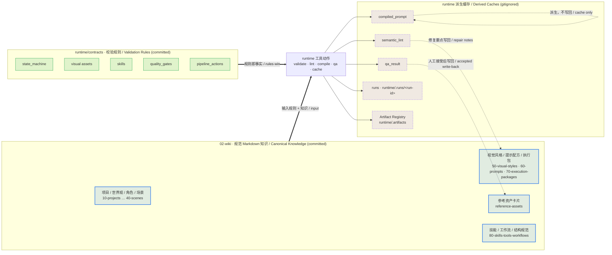

# runtime 工具边界图 / Runtime Tool Boundary Map

> ARCHITECTURE / BOUNDARY MAP ONLY. 本文件只描述 runtime 工具层与 Obsidian 规范知识层之间的边界，不实例化任何真实故事、提示、QA 结果或资产。所有引用一律使用占位符（例如 `<project-id>`、`<run-id>`、`<artifact-id>`、`EXAMPLE_VALUE`、占位）。
> This is a boundary map. It never instantiates a real story, prompt, QA result, or asset. Every reference is a placeholder.

## 1. 这张图回答什么 / What This Map Answers

本图从**边界（boundary）**角度回答：哪些产物是 **runtime 工具层的派生缓存（derived caches）**，哪些是 **`02-wiki` 的规范 Markdown（canonical Markdown）**，以及二者之间唯一合法的连接——**写回箭头（write-back arrow）**：runtime 的结果只有被人工接受后，才以规范卡片的形式写回 `02-wiki`。

This map draws the boundary between the runtime tool layer (validate / lint / compile / QA / cache) and the Obsidian canonical knowledge in `02-wiki`. It shows which artifacts are derived caches versus canonical Markdown, and the single legitimate connection between them: the write-back arrow from runtime results into canonical cards.

相关角度 / Related views: [story-production-system-map.md](./story-production-system-map.md) · [image-production-lineage-map.md](./image-production-lineage-map.md) · [webgpt-two-window-workflow-map.md](./webgpt-two-window-workflow-map.md)

母文档立场 / Parent doctrine: [AI+Story-Obsidian-Wiki-Architecture.md](../../../00-system/architecture/AI+Story-Obsidian-Wiki-Architecture.md)

## 2. 边界图 / Boundary Diagram



> 图例 / Legend：**蓝色 = 规范 Markdown（committed，事实来源）**；**绿色 = contracts 校验规则（committed，机器规则）**；**紫色虚线 = 派生缓存（gitignored）**。点状箭头 `-.->` 是 **写回 / 接受动作**，是缓存进入规范层的唯一合法通道。

## 3. 边界两侧 / The Two Sides of the Boundary

### 3.1 规范侧 / Canonical Side（`02-wiki`，committed）

- 是 **长期、人类可读的事实来源（source of truth）**。
- 持有 11 类资产卡片、执行包、索引、看板，以及本图这类结构地图。
- 任何持久生产决策都 **必须** 落在这里。
- 通过 runtime 校验，但 **不被 runtime 自动改写**。

### 3.2 规则侧 / Rules Side（`runtime/contracts`，committed）

- 持有 **校验规则（VALIDATION RULES ONLY）**：状态机、视觉资产规则、技能规则、质量门、流水线动作。
- 这是机器可读的规则层；当 Markdown 与 contracts 冲突时，**以 contracts 为准（contracts win）**。
- contracts 是规则，不是生产数据，也不是规范知识卡片。

### 3.3 派生侧 / Derived Side（gitignored 缓存）

下列产物 **都是派生缓存（derived caches），均不进 git**：

| 产物 / Artifact | 路径 / Path | 说明 / Note |
| --- | --- | --- |
| `compiled_prompt` | runtime（`.runs` / `.artifacts`） | 由执行包编译得到，缓存 |
| `semantic_lint` | runtime 输出 | lint 结果，缓存 |
| `qa_result` | runtime 输出 | 校验/QA 结论，缓存 |
| `runs` | `runtime/.runs/<run-id>/` | 运行清单 / checkpoint / manifest，缓存 |
| Artifact Registry | `runtime/.artifacts/` | 身份 / 哈希 / 血缘 / 状态助手，缓存 |

> 注：`.gitignore` 明确忽略 `runtime/.runs/`、`runtime/.artifacts/` 等目录。这些目录可被重建、清理或丢弃，**不是事实来源**。

## 4. 写回箭头 / The Write-Back Arrow

边界的关键不是“隔离”，而是 **唯一合法的回流方向**：

```
runtime 结果 (qa_result / semantic_lint / compiled_prompt)
   ──人工接受 / human-accepted──▶  02-wiki 规范 Markdown 卡片
```

- **只有被人工接受**的 runtime 结果，才能以规范卡片的形式 **写回（write back）** `02-wiki`（例如：通过验收 → 写回参考资产卡片；lint 暴露的问题 → 修复要点写回相关卡片）。
- **反向不成立**：规范卡片不从缓存“自动同步”而来；缓存丢失不影响事实来源。
- **Artifact Registry 不是登记表**：它是缓存 + 血缘助手。规范登记表是 `02-wiki` 的参考资产卡片 + 执行包卡片集合。

## 5. 核心规则 / Core Rules

1. **规范 Markdown（`02-wiki`）是事实来源；runtime 是校验 / lint / 编译 / QA / 缓存工具层。**
2. **`compiled_prompt`、`semantic_lint`、`qa_result`、`runs`、Artifact Registry 都是派生缓存**，位于 `runtime/.runs` 与 `runtime/.artifacts`，**均 gitignored，可重建可丢弃**。
3. **contracts 是机器规则，冲突时以 contracts 为准；但 contracts 不是规范知识卡片，也不持有生产决策。**
4. **缓存进入规范层的唯一通道是写回箭头**，且必须经人工接受。
5. **Artifact Registry 是缓存 + 血缘助手，不是规范资产登记表。**
6. **runtime 不创建故事项目、不生成图像、不创建执行包；外部图像执行停在人工执行点。**
