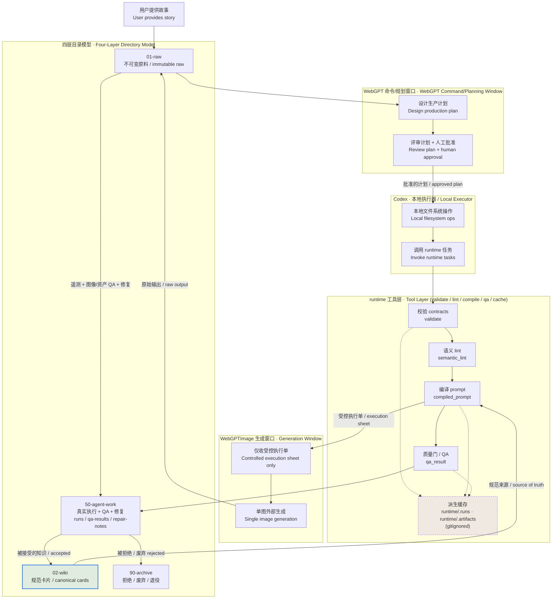

# 故事生产系统总图 / Story Production System Map

> ARCHITECTURE / WORKFLOW MAP ONLY. 本文件只描述系统结构与端到端流程，不实例化任何真实故事、角色、场景、图像提示或资产。所有引用一律使用占位符（例如 `<project-id>`、`<scene-id>`、`<asset-id>`、`EXAMPLE_VALUE`、占位）。
> This is a structural map. It never instantiates a real story, character, scene, prompt, or asset. Every reference is a placeholder.

## 1. 这张图回答什么 / What This Map Answers

本图从**整体系统**的角度回答一个问题：一段用户故事，如何穿过四个目录层（`01-raw → 02-wiki → 50-agent-work → 90-archive`）、横向的 **runtime 工具层**、两个 **WebGPT 窗口** 以及 **Codex 本地执行器**，最终沉淀为 `02-wiki` 中可维护的规范 Markdown 卡片（canonical cards）。

This map looks at the **whole system**: how one user story passes through the four directory layers, the lateral runtime tool layer, the two WebGPT windows, and the Codex local executor, and finally settles into maintainable canonical Markdown cards in `02-wiki`.

相关角度的其它三张图 / The other three maps view the same flow from different angles:

- 图像血缘 / Image lineage: [image-production-lineage-map.md](./image-production-lineage-map.md)
- runtime 边界 / Runtime boundary: [runtime-tool-boundary-map.md](./runtime-tool-boundary-map.md)
- 双窗口工作模型 / Two-window workflow: [webgpt-two-window-workflow-map.md](./webgpt-two-window-workflow-map.md)

总体架构母文档 / Parent architecture doc: [AI+Story-Obsidian-Wiki-Architecture.md](../../../00-system/architecture/AI+Story-Obsidian-Wiki-Architecture.md)

## 2. 端到端流程图 / End-to-End Flow Diagram

## 3. 流程散文解释 / Prose Walkthrough

1. **用户提供故事 → 落入 `01-raw`。** 原始用户输入与任何外部生成的首次落地都进入 `01-raw/story-lab/`。该层 **只追加（append-only）**，落地后永不重写，是唯一的“原始事实”。

2. **WebGPT 命令/规划窗口设计并评审计划。** 规划窗口读取原料与 `02-wiki` 规范卡片，产出一份生产计划，并在 **人工批准门（human approval gate）** 上接受评审。规划窗口 **不直接触碰本地文件系统执行细节，也不直接生成最终图像**。

3. **Codex 执行本地文件系统与 runtime 任务。** 计划被批准后，Codex 作为本地执行器落地具体操作：读写文件、调用 runtime 的 validate / lint / compile / qa 动作。Codex 是规划意图与本地真实产物之间的桥。

4. **runtime 工具层做校验 / lint / 编译 / QA，并产出派生运行数据（缓存）。** runtime 横向服务，验证 contracts 规则、跑语义 lint、编译 prompt、跑质量门。它的运行记录与 Artifact Registry 落在 `runtime/.runs` 与 `runtime/.artifacts`（均 gitignored），属于 **派生缓存**，不是规范登记表。

5. **`02-wiki` 存放规范卡片（canonical cards）。** 故事、世界观、角色、场景、视觉风格、提示配方、执行包、参考资产、技能/工作流，全部以 Obsidian Markdown 卡片形式存在于 `02-wiki/story-lab/` 编号分区中，是长期、人类可读的事实来源。

6. **独立的 WebGPTImage 窗口只接收受控执行单。** 当链路推进到出图阶段，编译产物被裁剪为一张 **受控执行单（controlled execution sheet）** 交给 WebGPTImage 窗口；该窗口 **永不看到整个仓库**，只在一个人工执行点生成单张图像。

7. **生成输出先落 `01-raw`。** 外部生成的原始图像产物首次落地仍回到 `01-raw`，保持“原始事实先落地”的不变量。

8. **QA 与修复记录进入 `50-agent-work`。** 遥测（telemetry）、图像 QA、资产 QA、修复笔记（repair-notes）、生成运行记录（runs）写入 `50-agent-work/story-lab/`。这是“真实执行/中间物”层，可频繁追加、可被清理或归档，**不是长期事实来源**。

9. **被接受的知识写回 `02-wiki` 规范 Markdown 卡片。** 一旦某资产通过验收，持久的生产决策被写回 `02-wiki` 对应卡片（例如参考资产卡片）。**这一步是体系的闭环：任何持久决策都必须回到规范卡片。**

10. **被拒绝/废弃/退役的资产进入 `90-archive`。** 不通过或退役的内容移入 `90-archive/story-lab/`，只进不改（write-once for the record），用于追溯与隔离。

## 4. 层职责对照 / Layer Responsibility Legend

| 层 / Layer | 路径 / Path | 持有内容 / Holds | 是否规范来源 / Canonical? |
| --- | --- | --- | --- |
| 原料 / Raw | `01-raw/` | 不可变原始输入、外部生成首次落地 | 否（原始事实，只追加） |
| 维基 / Wiki | `02-wiki/` | 规范 Markdown 卡片、执行包、索引、本图 | **是（唯一长期事实来源）** |
| Agent 工作 / Agent-work | `50-agent-work/` | runs / qa-results / repair-notes / 遥测 | 否（派生中间物，可清理） |
| 归档 / Archive | `90-archive/` | 拒绝 / 废弃 / 退役 / 遗留 | 否（只进不改，供追溯） |
| 工具 / Runtime | `runtime/` | contracts 规则 + 派生缓存 + Artifact Registry | 否（验证/编译工具层） |

两个窗口与执行器 / The two windows and the executor:

| 角色 / Role | 定位 / Role | 关键约束 / Key Constraint |
| --- | --- | --- |
| WebGPT 命令/规划窗口 | 设计 + 评审计划 | 不直接执行本地操作，不直接出最终图 |
| Codex 本地执行器 | 落地文件系统 + runtime 任务 | 不调用外部出图工具；停在人工执行点 |
| WebGPTImage 生成窗口 | 单图外部生成 | 只收受控执行单，永不看到整个仓库 |

## 5. 核心规则 / Core Rules

1. **Markdown 规范卡片是事实来源（source of truth）。** `02-wiki` 中的卡片承载所有持久生产决策。
2. **runtime 是校验 / lint / 编译 / QA 工具层。** 它的产出是派生缓存，不拥有规范知识。
3. **Artifact Registry 与 `runtime/.runs`、`runtime/.artifacts` 是派生缓存（derived caches），均 gitignored，不是规范登记表。**
4. **原料层只追加、永不重写。** 中间物属于 `50-agent-work/`；废弃物属于 `90-archive/`。
5. **生成输出先落 `01-raw`，再经 `50-agent-work` QA，被接受后写回 `02-wiki`，被拒绝转入 `90-archive`。**
6. **两窗口隔离 + 人工批准门。** 规划窗口设计计划、生成窗口只收受控执行单；每次出图与每次接受都需人工批准。
7. **runtime 永不调用外部图像工具**，它停在一个人工执行点（human execution point）。
