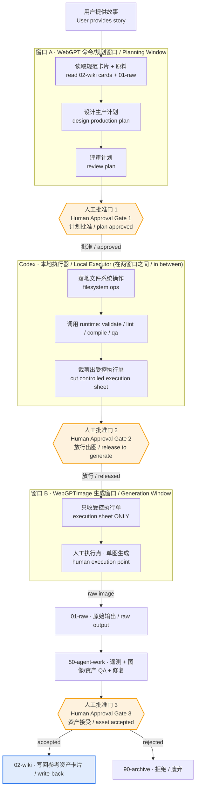

# WebGPT 双窗口工作模型图 / WebGPT Two-Window Workflow Map

> ARCHITECTURE / WORKFLOW MAP ONLY. 本文件只描述双窗口操作模型与人工批准门，不实例化任何真实故事、提示、执行单或图像。所有引用一律使用占位符（例如 `<project-id>`、`<package-id>`、`<asset-id>`、`EXAMPLE_VALUE`、占位）。
> This is a workflow map. It never instantiates a real story, prompt, execution sheet, or image. Every reference is a placeholder.

## 1. 这张图回答什么 / What This Map Answers

本图从**操作模型（operating model）**角度回答：**WebGPT 命令/规划窗口**（设计 + 评审计划，**永不直接生成最终图像**）与 **WebGPTImage 生成窗口**（**只接收一张受控执行单**，在人工执行点生成单图）之间如何分工；**Codex** 作为中间的本地执行器做什么；每个窗口 **被允许 / 不被允许** 看到或做什么；以及 **人工批准门（human approval gates）** 落在哪里。

This map describes the two-window operating model: the WebGPT command/planning window (designs + reviews the plan, never directly generates the final image) versus the WebGPTImage generation window (only receives a controlled execution sheet, generates single images at a human execution point). Codex is the local executor in between. It states what each window is and is NOT allowed to see/do, and where the human approval gates sit.

相关角度 / Related views: [story-production-system-map.md](./story-production-system-map.md) · [image-production-lineage-map.md](./image-production-lineage-map.md) · [runtime-tool-boundary-map.md](./runtime-tool-boundary-map.md)

## 2. 双窗口流程图 / Two-Window Flow Diagram

## 3. 三个角色的边界 / Boundaries of the Three Roles

### 3.1 窗口 A · WebGPT 命令/规划窗口 / Planning Window

- **是什么 / Is**：设计与评审生产计划的“大脑”。读取 `02-wiki` 规范卡片与 `01-raw` 原料，产出可评审的计划。
- **被允许 / Allowed**：阅读规范卡片与原料；提出计划、技法、节奏与结构建议；标记需人工批准的项。
- **不被允许 / NOT allowed**：
  - **不直接触碰本地文件系统执行细节**（落地交给 Codex）。
  - **不直接生成最终图像**（出图只发生在窗口 B 的人工执行点）。
  - 不绕过批准门，不把计划当成已落地的产物。

### 3.2 Codex · 本地执行器 / Local Executor（在两窗口之间）

- **是什么 / Is**：把已批准计划落地为本地真实产物，并调用 runtime 工具的执行器。
- **被允许 / Allowed**：读写本地文件系统；调用 runtime 的 validate / lint / compile / qa；把编译产物 **裁剪为一张受控执行单（controlled execution sheet）** 交给窗口 B；将原始输出、遥测、QA、修复记录归位到 `01-raw` / `50-agent-work`。
- **不被允许 / NOT allowed**：
  - **不调用外部图像工具**——它停在一个人工执行点（human execution point）。
  - 不创建故事项目、不生成图像、不擅自创建执行包/发布包。
  - 不跳过上游门禁，不把派生缓存当成第二事实源。

### 3.3 窗口 B · WebGPTImage 生成窗口 / Generation Window

- **是什么 / Is**：只在人工执行点生成单张图像的“手”。
- **被允许 / Allowed**：接收 **一张受控执行单**；据此生成 **单张** 候选图。
- **不被允许 / NOT allowed**：
  - **永不看到整个仓库**——只见受控执行单内的受控字段。
  - 不读取规范知识库、不读其它项目、不做批量自动出图。
  - 不自行决定接受/拒绝（验收在 `50-agent-work` + 批准门 3）。

## 4. 每个窗口的可见/可做对照 / Allowed vs Not-Allowed Matrix

| 能力 / Capability | 窗口 A 规划 | Codex 执行 | 窗口 B 生成 |
| --- | --- | --- | --- |
| 看 `02-wiki` 规范卡片 | 是 / yes | 是 / yes | **否 / no** |
| 看整个仓库 / 文件系统 | 否（只读卡片层） | 是 / yes | **否（只见执行单）** |
| 设计 / 评审计划 | **是 / yes** | 否 / no | 否 / no |
| 落地文件系统 + 调 runtime | 否 / no | **是 / yes** | 否 / no |
| 生成最终单图 | **否 / no** | 否（停在人工执行点） | **是 / yes** |
| 调用外部图像工具 | 否 / no | **否 / no** | 仅人工执行点单图 |
| 判定接受 / 拒绝 | 否 / no | 否 / no | **否（批准门 3）** |

## 5. 人工批准门 / Human Approval Gates

1. **批准门 1 · 计划批准（plan approved）**：窗口 A 的计划经人工评审通过，Codex 才开始落地。
2. **批准门 2 · 放行出图（release to generate）**：Codex 完成 validate / lint / compile / qa 并裁好受控执行单后，经人工放行，窗口 B 才生成。出图前 **必须** 已完成 Prompt 编译与语义 lint。
3. **批准门 3 · 资产接受（asset accepted）**：原始输出落 `01-raw`、经 `50-agent-work` 的遥测 + 图像 QA + 资产 QA 后，由人工决定接受或拒绝；接受则写回 `02-wiki` 参考资产卡片，拒绝则转入 `90-archive`。

## 6. 核心规则 / Core Rules

1. **三角色隔离**：窗口 A 设计/评审，Codex 本地落地，窗口 B 只收受控执行单出单图。
2. **规划窗口永不直接生成最终图像**；生成窗口 **永不看到整个仓库**。
3. **Codex 永不调用外部图像工具**，停在人工执行点。
4. **三道人工批准门**：计划批准 → 放行出图 → 资产接受，缺门不得跨阶段。
5. **出图前必须先 Prompt 编译 + 语义 lint。**
6. **被接受的知识写回 `02-wiki` 规范卡片；被拒绝/废弃进入 `90-archive`。** runtime 与窗口产物只是派生缓存，不是事实来源。
